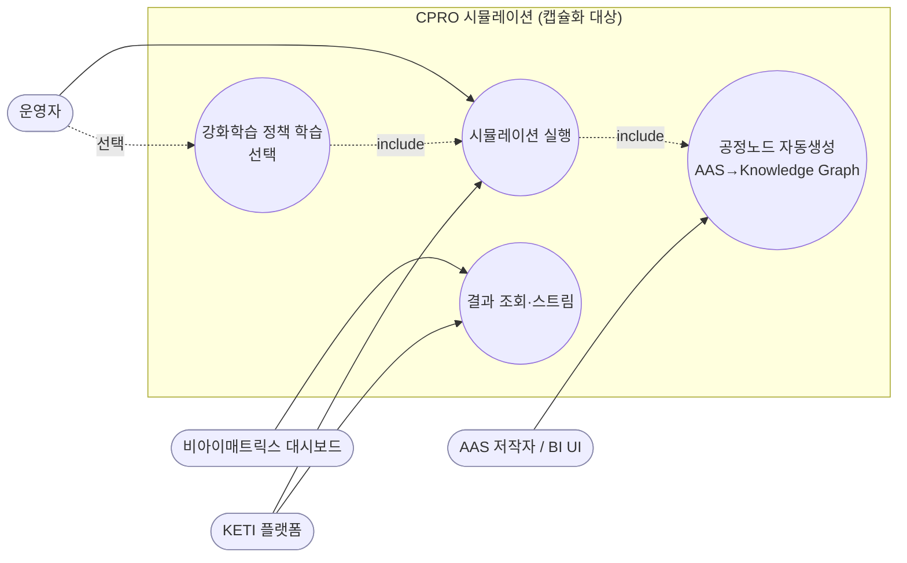
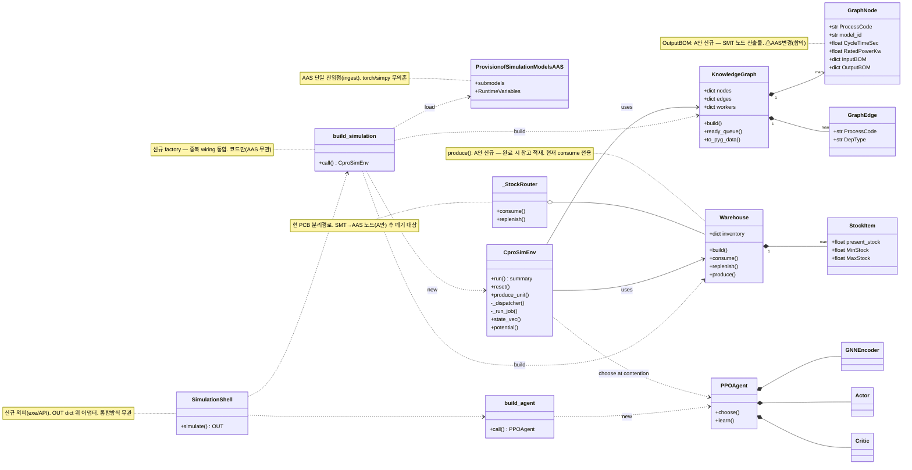
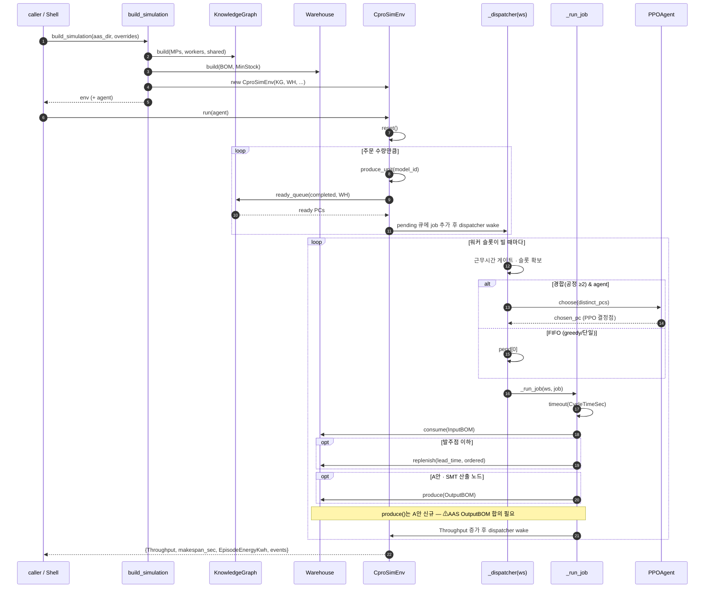
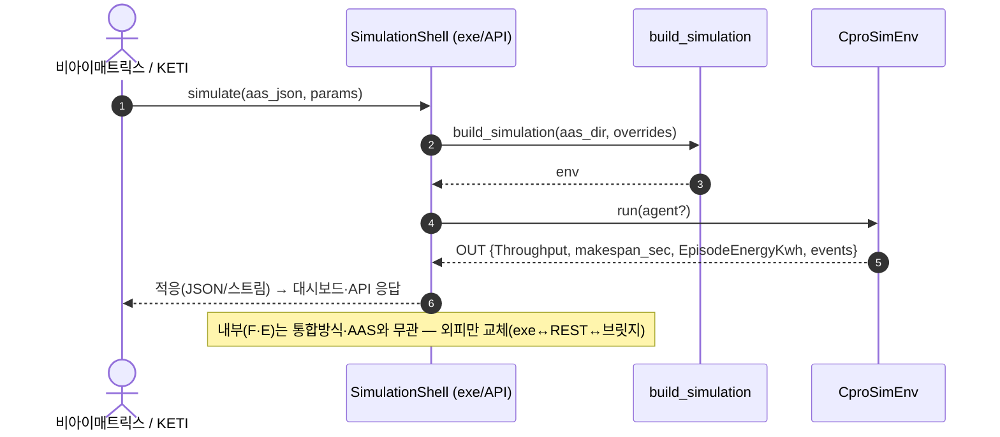

# CPRO 시뮬레이션 — 모듈 분할 · 캡슐화 UML

비아이매트릭스(대시보드 코드 전달) · KETI(API 연동) 산출물(과제수행계획 Line 20·21, 2026-08~10)을
위한 모듈 분할/캡슐화 설계. 회의 합의: "플랫폼 안에서 UML(usecase/class/sequence)로 BI와 의사소통".

## 범례 (표기)

- **기존(solid)** — 현재 코드에 이미 있는 것.
- **신규-코드** — 추가할 코드. **AAS 변경 없음** (factory, 외피).
- **⚠ AAS변경-합의필요** — A안(SMT→창고 적재) 때문에 AAS 템플릿에 새 필드가 필요한 것.
  → AAS 구조 변경은 단독 진행 금지, 합의 대상.

### A안이 요구하는 AAS 변경 (합의 항목 — 이것 하나)

SMT 공정 노드가 "무엇을 몇 개 창고에 적재하는지" 알아야 하므로, **SMT 산출 노드에 `OutputBOM`**
(item_code → Quantity) 을 추가해야 함. 이 한 가지 외에는 전부 코드 변경:
- `Warehouse.produce(OutputBOM)` — 노드 완료 시 산출물 적재 (현재 `Warehouse`는 consume 전용).
- SMT→AAS 노드화가 끝나면 `cpro_smt.py` stub + `_StockRouter` 특수경로는 폐기.

---

## 1. 유스케이스 다이어그램

- 입력 데이터의 유일 원천은 AAS JSON(BI UI가 생성). 실행은 그래프 생성을 **include**.
- 강화학습은 실행을 반복하는 **선택** 유스케이스 — 핵심 경로 아님(회의: "RL 핵심 아님").

---

## 2. 클래스 다이어그램 (모듈 분할)

5계층: ingest(공정노드 입력) → 도메인(공정노드/창고) → 시뮬생성 → 강화학습 → factory/외피.

계층 ↔ 회의 3모듈:
- **공정 노드 생성** = `ProvisionofSimulationModelsAAS` + `KnowledgeGraph`/`Warehouse`
- **시뮬 생성** = `CproSimEnv`
- **강화학습** = `PPOAgent`(+`GNNEncoder`/`Actor`/`Critic`) — `CproSimEnv`에 꽂는 선택 플러그인
- **factory/외피** = `build_simulation`/`build_agent` + `SimulationShell` (신규)

---

## 3. 시퀀스 다이어그램 — 시뮬레이션 실행(핵심 흐름)

---

## 4. 시퀀스 다이어그램 — 캡슐화/통합 경계 (BI·KETI)

- **OUT 계약을 안정 dict로 고정** → 대시보드 출력/자동생성 설계안이 미정이어도 내부 영향 없음.
- 외피는 `build_simulation` 위 얇은 어댑터 — exe/REST/브릿지 선택은 BI 설계안 도착 후 결정.
