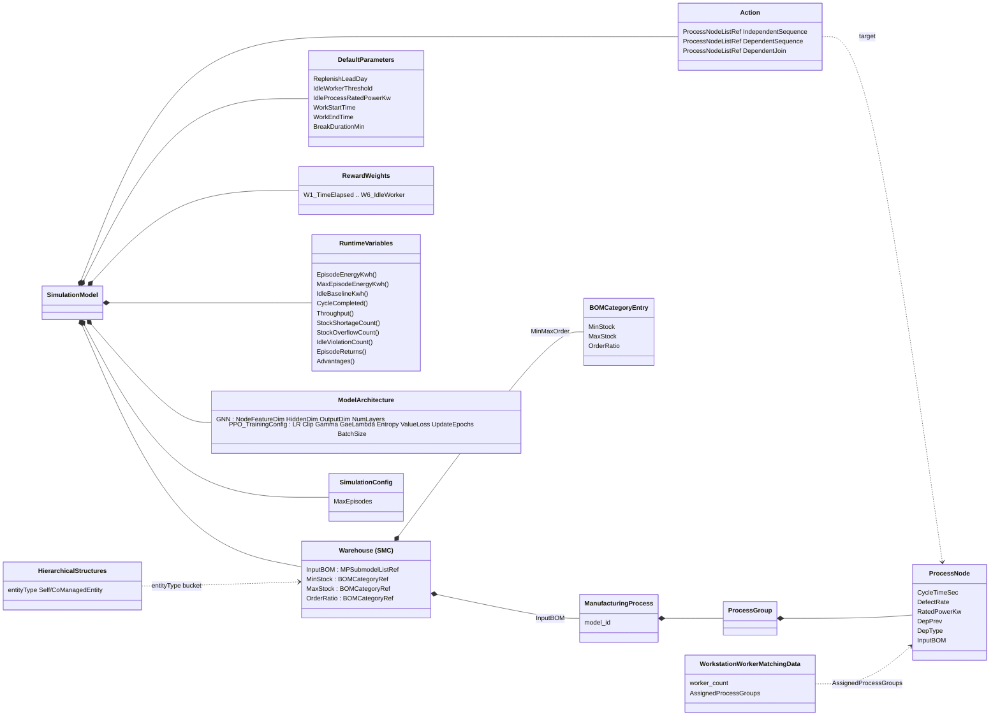
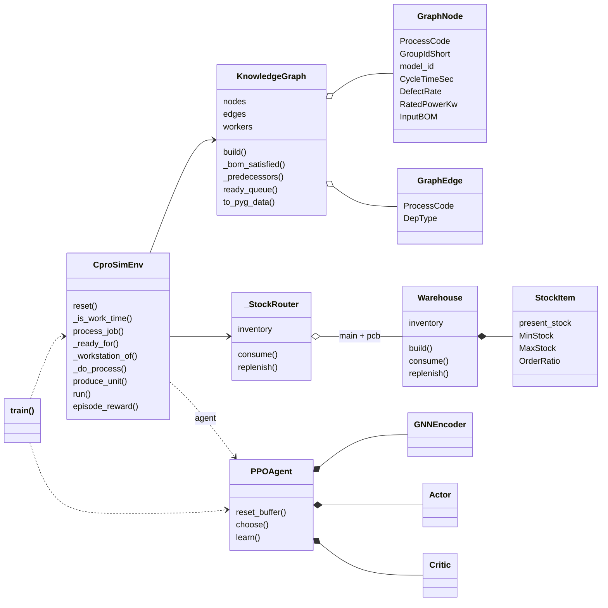

# simulation_ver0.py 단독 실행 체크리스트

목표: `python simulation_ver0.py` 가 path_extractor 만으로 끝까지 동작.
입력 데이터 진입점은 PSM 단일 (`ProvisionofSimulationModelsAAS`). redesign / cpro_config 미사용.

진행 방식: "임포트 → 실행 → 첫 에러 → 최소 수정 → 재실행" 반복으로 발견.

상태 표기: `[x]` 완료·검증 / `[~]` 부분·원복/보류 / `[ ]` 미해결

---

## A. 도메인 레이어 (완료, 실행 검증)

- [x] **A1. import 문 전무** — `from __future__ import annotations`, `dataclass`, `Dict`, `simpy`, `torch`, `torch_geometric` 추가
- [x] **A2. `gym` 미설치 / 미사용** — `import gym` 제거, `class CproSimEnv(gym.Env)` → `class CproSimEnv:`
- [x] **A3. forward-ref NameError** (`Warehouse` 가 `KnowledgeGraph` 보다 뒤 정의) — `from __future__ import annotations` 로 annotation 평가 지연
- [x] **A4. `__main__` 입력 데이터 전무** — path_extractor 데이터 head 추가 (PSM 단일 진입, AAS 경로 주석). 추출: `ManufacturingProcesses`/`workers`/`WarehouseManagedBOM`/`BOMCategory`/`Independent·Dependent·DependentJoin`/`RewardWeights`/`ReplenishLeadDay`/`IdleWorkerThreshold`/`WorkStartTime`/`WorkEndTime`/`break_*`/`MaxEpisodes`/`MaxEpisodeEnergyKwh`/GNN·PPO 하이퍼파라미터
- [x] **A5. `GraphEdge.build` 가 `DepPrev` 미전달** → `TypeError` — 루프 변수 `DepPrev` 그대로 전달 (이후 사용자가 edges 키=이전공정 / `_predecessors` 역검색 구조로 리팩터)
- [x] **A6. `CproSimEnv.__init__` 이 `MaxEpisodeEnergyKwh` 미수용** (그러나 `step()` 사용) → 파라미터 + 대입 추가
- [x] **A7. `GraphNode` 에 `DepPrev`/`DepType` 필드 없음** → 추가 후, 사용자 리팩터로 노드 캐싱 폐기·edges 단일표현으로 전환
- [x] **A8. `ready_queue` 의존성 판정** — `DependentSequence`=`any(dep in completed)`, `DependentJoin`=`all(dep in completed)`, `if PC in completed: continue` 가드
- [~] **A9. W1/W2 정규화 분모 — 보류로 원복** — 한때 W1 `work_day_sec`→`unit_seconds*qty`, W2 `MaxEpisodeEnergyKwh`→`unit_kwh*qty` 로 변경했으나, 예랑누나 req("CamelCase 는 적용부에서 건들지 말 것")에 따라 **step() 표현식 원형 복귀**. 현재 잔존: `reset()` 의 `unit_seconds`/`unit_kwh` 유도 + `self.MaxEpisodeEnergyKwh = unit_kwh*target_qty`(정의 계층). **W1/W2 분모 결정은 ⏸ 보류 섹션 참조.**

→ KG / Warehouse / `reset` / `ready_queue` 는 path_extractor 만으로 동작, greedy step 모델 9/9 완주 확인.

---

## B. PPO / train 구동부

- [x] **B1. `reset()` 반환 계약 불일치** — `reset()` 이 `ready` list 반환, 소비처는 `observation['ready']` dict 기대 → `reset()` 이 `{'ready': ..., 'KnowledgeGraph': ...}` 반환하도록 (producer 가 계약 소유, B1 철학)
- [x] **B2. Actor/Critic forward 내 `nn.Linear` 매 호출 생성 (구조적)** — Critic: `value_head=Linear(HiddenDim,1)` `__init__` 등록 → `self.value_head(x)`, dead `self.HiddenDim` 제거. Actor: 아래 B3 와 함께 per-node 재구조로 해소.
- [x] **B3. 가변 `ActionSpaceDim` (구조적) — Actor per-node 재구조** — `score_head=Linear(HiddenDim,1)` `__init__` 등록, `forward(x)` (x:(N,GNNEmbDim)) → `score_head(x).squeeze(-1)` → softmax. `select_action`/`compute_loss`: mean-pool·`ActionSpaceDim` 제거, `self.Actor(ready_embeddings)` 직접. action 인덱스 복원 `ready.index(action[0])` (반환/저장 계약 불변). AAS `ModelArchitecture.PPO.Actor.ActionSpaceDim` Property 제거 → Actor AAS=`{GNNEmbeddingDim}` 코드↔AAS 일치. Critic 은 per-state mean-pool 유지. (B2+B3+action표현 동시 해소)
- [x] **B4. `compute_loss` typo 4종** — `insert(0,globals)`→`insert(0,G)`, `Episodereturns`→`EpisodeReturns`(2), `ratio*advantages`→`ratio*Advantages`, `mse_loss(_,Episodereturns)`→`EpisodeReturns`
- [x] **B5. `self.ValueLossCoef` 미할당** — `__init__` 에 `self.ValueLossCoef = ValueLossCoef` 추가
- [x] **B6. AAS `PPO.TrainingConfig.UpdateEpochs`=None** — JSON Property 에 `"valueType":"xs:int","value":"4"` (스펙 EPOCHS=4). 추출값 4 int 검증
- [x] **B7. observation dict 에 `KnowledgeGraph` 키 부재** — reset()/step() observation 에 `'KnowledgeGraph': self.KnowledgeGraph`(공유 ref) 추가
- [ ] **B8. GAE 미구현** — `GaeLambda` 추출/전달은 되나 `compute_loss` 는 단순 할인누적 G 만 사용. spec(λ=0.95 GAE) 불일치
- [~] **B9. ⚠ AAS contract 갭 (0/9 deadlock 근본 원인)** — KG Node 3개(`BT5_31`←BT5_50 / `NVD_52`←NVD_53 / `VD7_70_1`←VD7_70_2)가 Action(IS/DS/DJ) 누락 → `ready_queue` 가 영구 차단 → 3모델 전부 체인 막힘 → `target_qty=9` 에서 step 80, completed 40/81, Throughput 0. RL/스케줄정책·`completed.clear()`(실측 0회) 무관. 과거 패치를 다른 작성자 최신 AAS 가 재누락. (현 AAS 로는 mod/redesign 도 동일 — ready_queue 동일 구조)
  - [x] B9-a (데이터) — `ProvisionOfSimulationModel.json` `Action` 에 GlobalReference 3개 추가 (VD7_70_1→DependentSequence, BT5_31·NVD_52→DependentJoin). 백업 `.bak3`. 검증: Action 81=KG 81(누락 0), greedy 9/9 완주(479 step)
  - [ ] B9-b (잠복, 별개) — `self.completed` 전역 단일 + `process_job` 의 `if PC not in edges: completed.clear()`: terminal 도달 시 다른 진행분까지 초기화. 멀티유닛/RL 치명. 유닛-local `done_set` 필요 (= `produce_unit`, → C(a) 수렴)
- [ ] **B10. ⚠ PPO `update()` NaN 크래시 (현재 블로커)** — `python simulation_ver0.py` 가 에피소드를 못 넘김. 체인: ① 미니배치(BatchSize=64) 마지막 배치 1샘플 → `Advantages.std()`(unbiased,n=1)=NaN (경고 L309) → ② grad clip 부재(spec clip_grad_norm 0.5 미구현)로 backward 가 전 파라미터 NaN 오염 → ③ 다음 forward Actor softmax `[nan×N]` → `Categorical` simplex 위반 ValueError. **가중**: W1 `env.now/work_day_sec` (work_day_sec=하루) reward 폭주(reward_sum ≈ -50만)로 grad 폭발 가속 — ⏸ 보류 정규화와 동일 뿌리. **부수 버그**: `value_preds=torch.stack(...).squeeze()` 가 1원소를 스칼라로 → `mse_loss` shape 불일치(경고 L339).
  - 안정화 후보(보류 유지 시): `Advantages.std(unbiased=False)` 또는 n<2 스킵 / `clip_grad_norm_(0.5)` / `value_preds` shape 정합
  - 근본(정규화 재검토 시): W1/W2 분모 정상화로 reward 스케일 정리 + 위 가드

---

## 현황 (마일스톤 — ⚠ 완주 미달성)

- 도메인 레이어 + PPO 크래시 체인(B1·B4·B5·B6·B7) + 구조 버그(B2·B3) **해소**.
- B9-a 로 0/9 deadlock 해소 → greedy step 모델 9/9 완주.
- **그러나 `python simulation_ver0.py` 전체 실행은 미완주**: `agent.update()` 경로에서 **B10 NaN 크래시**. (앞서 "무크래시 완주" 보고는 2-epi 계측이 `update()` 를 건너뛴 탓 — 정정.)
- 다음 블로커: **B10** (+ 그 뿌리인 ⏸ 정규화 보류).

---

## C. 결정 대기 — RL 구동부 방향

- [ ] **(a) 권장**: ver0 `step/train`+PyG PPO → mod 검증본(`run(agent)`/`produce_unit`/`simpy.Resource` 워커병렬 + R-GCN PPO) 교체. 300/300 검증, 워커병렬 요구 충족, B9-b 동시 해소
- [ ] **(b)**: ver0 PyG PPO 그 자리 재작성 + step 모델 유지(워커병렬 없음). 동작 재검증 필요

---

## D. ver0 ↔ ver0_mod 구조 비교 — PSM 계층 보존 여부 (분석, 2026-05-18)

질문: PSM(`path_extractor`)이 표현하는 KG 의존 계층이 ver0 에는 있는데 mod 에서 파괴됐는가.
특히 `CproSimEnv._ready` 소멸 → ready 는 어디서 표현되나.

결론: **KG 계층은 파괴 안 됨. 사라진 건 `_ready` 메서드 *이름* 이지 계층 *표현* 이 아님.**

상태범례: `[=]`보존(ver0 동일) `[→]`표현이동 `[+]`mod 강화 `[x!]`mod 미호출(누락)

### D-1. PSM (AAS) 계층 — classDiagram



### D-2. ver0_mod 런타임 클래스 — classDiagram



### D-3. 대응표 (PSM ↔ ver0_mod)

| PSM (AAS) 노드 | ver0_mod 대응 | 상태 |
|---|---|---|
| `Action.Independent/Dependent/DependentJoinSequence` | `__main__` 3리스트 → `KnowledgeGraph.ready_queue`/`_predecessors` | `[=]` 13~143행 바이트동일 |
| ↳ ready 소비 | ver0 `CproSimEnv._ready()`(전역 completed) → mod `_ready_for(model_id, done_set)`(유닛별) → `produce_unit` | `[→]` 표현이동 |
| `ProcessNode.CycleTimeSec/DefectRate/RatedPowerKw` | `GraphNode.*` (`build`, `to_pyg_data` x행렬) | `[=]` |
| `ProcessNode.DepPrev/DepType` | `GraphEdge` (`build`→edges, 이전→다음 단일표현) | `[=]` |
| `ProcessNode.InputBOM` / `mp.model_id` | `GraphNode.InputBOM`(`_bom_satisfied`·`consume`) / `GraphNode.model_id` | `[=]` |
| `Warehouse.MinStock/MaxStock/OrderRatio`→`BOMCategoryEntry` | `StockItem` / `Warehouse.build` | `[=]` |
| `DefaultParameters.ReplenishLeadDay` | `Warehouse.replenish` / `_StockRouter.replenish` | `[=]` |
| `DefaultParameters.IdleProcessRatedPowerKw` | `RuntimeVariables.IdlePowerKw` (`process_job` 에너지) | `[=]` |
| `DefaultParameters.WorkStartTime/WorkEndTime/BreakDurationMin` | `CproSimEnv._is_work_time` (mod: `process_job` 비근무 정확점프) | `[+]` |
| `DefaultParameters.IdleWorkerThreshold` | ver0 `RuntimeVariables.IdleViolationCount` (mod 보유만) | `[x!]` |
| `RewardWeights W1..W6` | ver0 `step()` 6항 전부 → mod `episode_reward` W1/W2/W5 | `[→]` W3/W4/W6 미사용 |
| `RuntimeVariables.EpisodeEnergyKwh/MaxEpisodeEnergyKwh/Throughput` | `process_job` / `episode_reward` / `_do_process`·`produce_unit` | `[=]` |
| `RuntimeVariables.CycleCompleted` | `process_job` (mod: `completed.clear()` 의미 폐기 — 유닛별 done_set) | `[→]` |
| `RuntimeVariables.IdleBaselineKwh/StockShortage/StockOverflow/IdleViolation` | ver0 `step()` — mod per-step 없어 미호출 | `[x!]` |
| `RuntimeVariables.EpisodeReturns/Advantages` | ver0 `PPOAgent.update` — mod `learn()` 자체 adv=R−V | `[x!]` |
| `ModelArchitecture.GNN` / `PPO.TrainingConfig` / `SimulationConfig.MaxEpisodes` | `GNNEncoder` / `PPOAgent.__init__`·`learn` / `train()` 루프 | `[=]` (mod: BatchSize·GaeLambda 보유만) |
| `ProductAAS.HierarchicalStructures.entityType` | ver0 `WarehouseManagedBOM` 한덩어리 → mod `CoManagedBOM`+`SelfManagedBOM` → `_StockRouter`/`cpro_pcb` | `[+]` |
| `WorkstationWorkerMatchingData` workers | ver0 `in_progress` 카운트만 → mod `_workstation_of`+`worker_resources`(simpy.Resource cap) | `[+]` |
| (PSM 대응 없음 — 순수 시뮬/RL) | 공통 `to_pyg_data`·`GNNEncoder/Actor/Critic.forward` / mod전용 `_do_process`·`produce_unit`·`run` / ver0전용 `step`·`skip`·`select_action`·`compute_loss`·`update` | — |

→ KG 계층(`Action` 3분류·`ready_queue`·SEQ/JOIN)은 `[=]` 바이트동일. `_ready`→`_ready_for` 는 `[→]` 표현이동(전역→유닛별), Warehouse·worker 는 `[+]` 강화. 실제 손실은 `[x!]` — **per-step 보상에 묶인 RuntimeVariables(W3/W4/W6·EpisodeReturns/Advantages·Idle 분해)뿐, KG 계층 아님.** C(a) 채택 시 `[x!]` 군은 reward 재설계(⏸ 정규화 보류·부가사실 Δ0)와 함께 다룸.

---

## 부가 사실 (실험 — 별개 이슈)

- 워커 병렬 완주 모델에서 **kwh 정책 무관 완전 불변** (모든 PC 1회씩). makespan 도 워커 capacity bottleneck 으로 정책 영향 ~0.5%.
- 그 결과 현재 reward 설계로 **정책이 reward 거의 무반응 → RL 학습 신호 ≈ 0** (15 epi Δ 0.0000). reward 재설계 별도 필요. (⏸ 정규화 재검토와 함께)

---

## 예랑누나 req
- 노드랑 엣지에 depPrev, depType이 있을 필요가 없어 보이므로 이전 공정 기준으로 다음 공정과 type 표현하는 기존 방식으로 전환하고 다음 공정에서 이전 공정이 뭔지 필요하다면 검색으로 확인하는 식으로 구현
  - 예상 리스크가 있는지?
- step에 
```
reward = (
            - (self.env.now / work_day_sec)                         * self.RewardWeights['W1_TimeElapsed']
            - self.EpisodeEnergyKwh[0] / self.MaxEpisodeEnergyKwh   * self.RewardWeights['W2_Energy']
            - self.StockOverflowCount  / step_count                 * self.RewardWeights['W3_StockOverflow']
            - self.StockShortageCount  / step_count                 * self.RewardWeights['W4_StockShortage']
            + (self.Throughput / self.target_qty)                   * self.RewardWeights['W5_Throughput']
            - self.IdleViolationCount  / step_count                 * self.RewardWeights['W6_IdleWorker']
        )
```
        를 
```
        reward = (
            - (self.env.now / (self.unit_seconds * self.target_qty))   * self.RewardWeights['W1_TimeElapsed']
            - (self.EpisodeEnergyKwh[0] / (self.unit_kwh * self.target_qty)) * self.RewardWeights['W2_Energy']
            - self.StockOverflowCount  / step_count                 * self.RewardWeights['W3_StockOverflow']
            - self.StockShortageCount  / step_count                 * self.RewardWeights['W4_StockShortage']
            + (self.Throughput / self.target_qty)                   * self.RewardWeights['W5_Throughput']
            - self.IdleViolationCount  / step_count                 * self.RewardWeights['W6_IdleWorker']
        )
```
        로 바꿨는데 MaxEpisodeEnergyKwh같은 CamelCase 항목들은 직접 적용될 때 건들지 말고 정의할때 반영하도록 해야 함.
        그리고 env.now를 저 work_day_sec로 나누는게 맞는지 unit_second*target_qty로 나누는게 모르겠네.
- SMT 구현

### ⏸ 정규화 변수 — 전체 보류 (엄밀 재검토 예정)

다음은 **건드리지 않고 동결**. 추후 엄밀 재검토 후 일괄 결정:
- W1 분모: `work_day_sec` vs `unit_seconds * target_qty` — 미정. step() 원형 유지.
- W2 분모: `self.MaxEpisodeEnergyKwh`. 현재 = step() 표현식 원형 + reset() 정의 계층 `self.MaxEpisodeEnergyKwh = unit_kwh * target_qty` 유도(예랑누나 req 준수). 유도식 잠정 — 재검토 대상.
- `MaxEpisodeEnergyKwh` head→`__init__` AAS None 전달 체인: **폐기 안 함, 유지** (사용자 지시).
- `unit_seconds`/`unit_kwh` 유도(reset): 유지하되 정의/스케일 재검토 대상.
- 부가사실 "reward 무반응(Δ0)" + B10 의 reward 스케일 폭주도 이 재검토와 함께 다룸.


## 시뮬

### 발주 정책 (Warehouse.consume / replenish) — 이슈 기록 (2026-05-18)

현 구현: 연속검토 (s,Q). s=재주문점=MinStock·OrderRatio, Q=고정가산=MaxStock·OrderRatio,
L=리드타임=`int(ReplenishLeadDay.value=24)*3600`=86400s=1일. 초기재고=MinStock.
`consume` 가 소비 후 "창고 전체 중 한 품목이라도 ≤s" 면 True → `replenish` 코루틴 1개
spawn → 1일 뒤 전 품목 중 ≤s 인 것마다 +Q.

기록만 (수정 보류):
- [ ] **미결발주(on-order) 추적 없음**: 저재고 발견 `consume` 마다 매번 새 replenish
      코루틴 → 동시성하 다수 중복 발주 → 같은 품목 Q 여러 번 가산(과발주).
- [ ] **글로벌 트리거·글로벌 보충**: X 소비가 전 품목 보충 트리거 → 무관 부품 Y도
      X 소비 1일 뒤 증가(부품 간 결합).
- [ ] **상한 클램프 없음**: MaxStock 까지 채우는 게 아니라 +Q 무조건 가산 → MaxStock
      초과 누적 가능(overflow 무방지).
- [ ] **근무캘린더 무시**: replenish 가 raw `env.timeout(86400)` — 야간/점심 무관 입고.
- [ ] **단위 모호**: 필드명 `ReplenishLeadDay`, value=24, 코드 `*3600`. 결과는 1일이나
      24가 "일" 의도였다면 `*86400`(=24일) 이어야 — 의도 확인 필요.
- (참고) ver0_mod: 이 정책은 메인(CoManaged) 창고만. PCB(SelfManaged)는 `cpro_pcb`
  일정증가(1h 간격) 별도 — 라우터가 PCB 재주문 트리거 무시.

- [ ] 라인별 캐퍼시티 미반영(라인별 2로 고정): step 모델(env.run(until=now+CT))이 동시성을 ~2로 묶어버려 